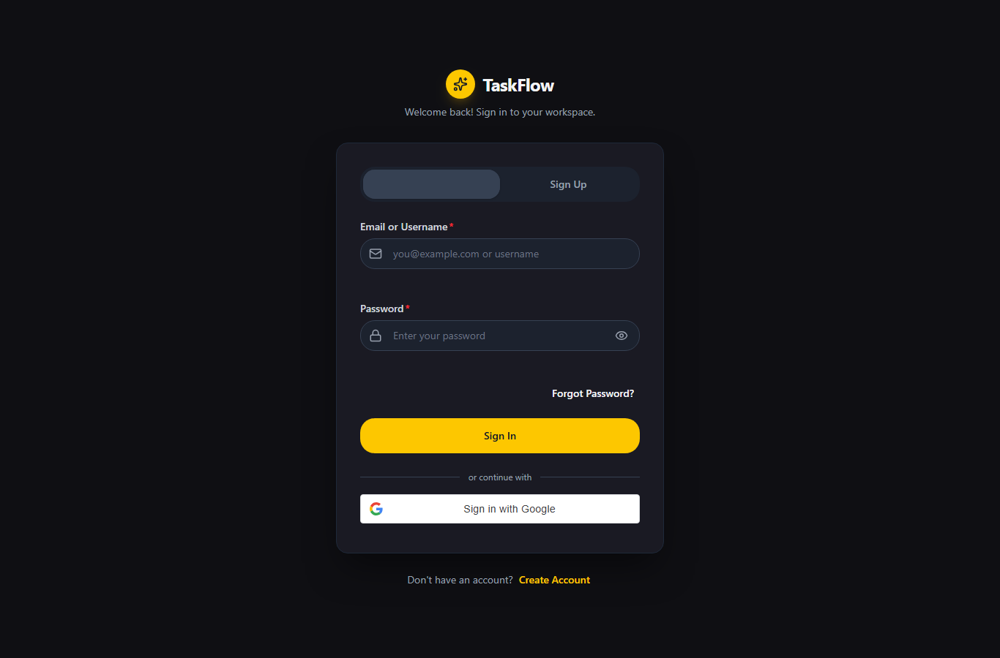
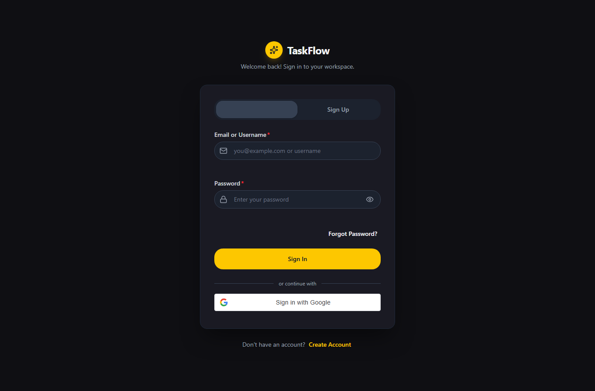
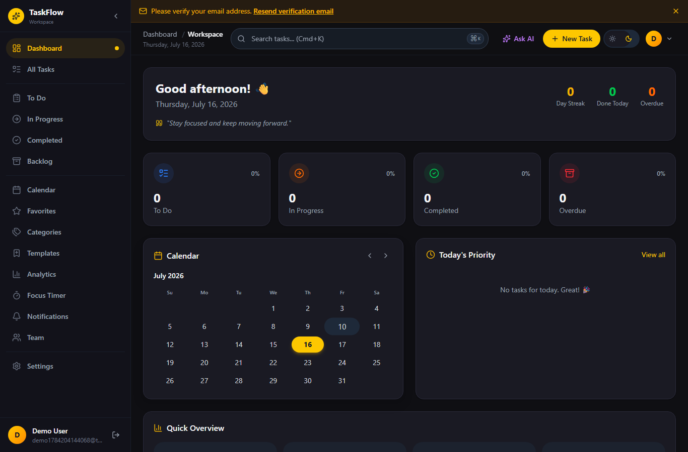
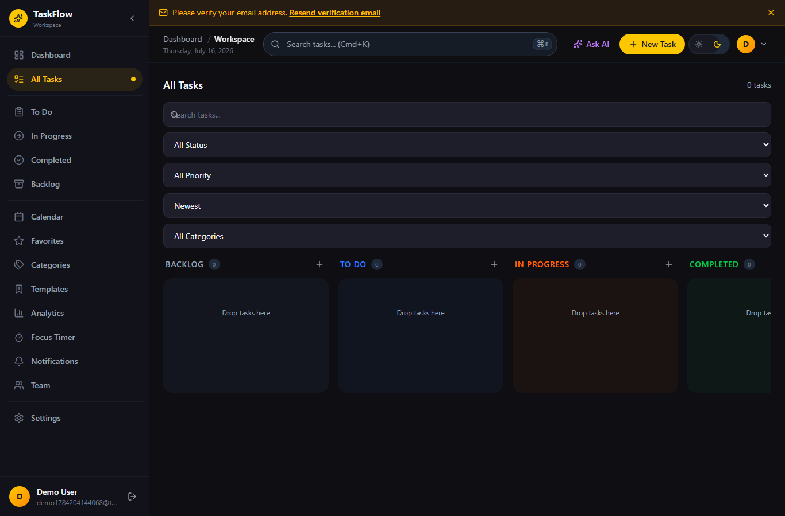
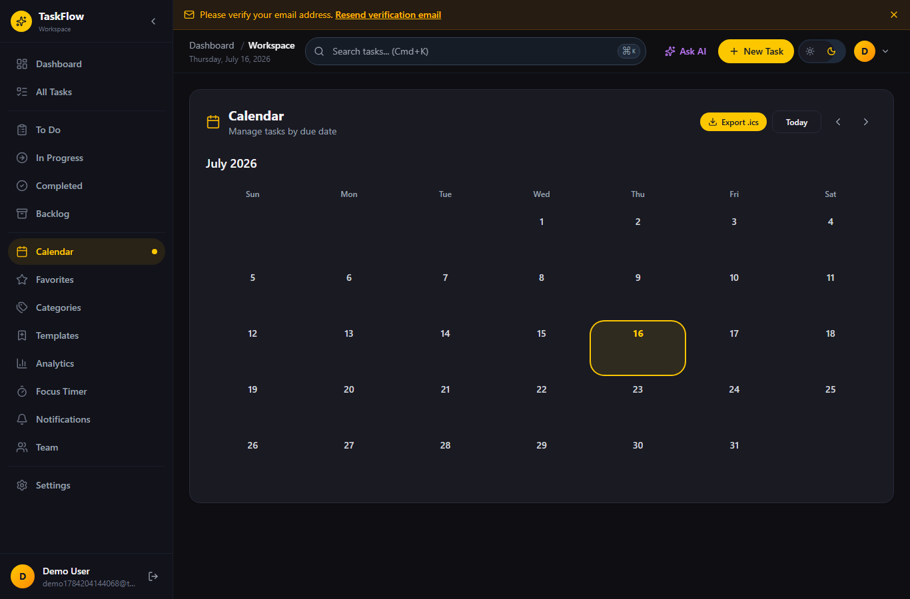
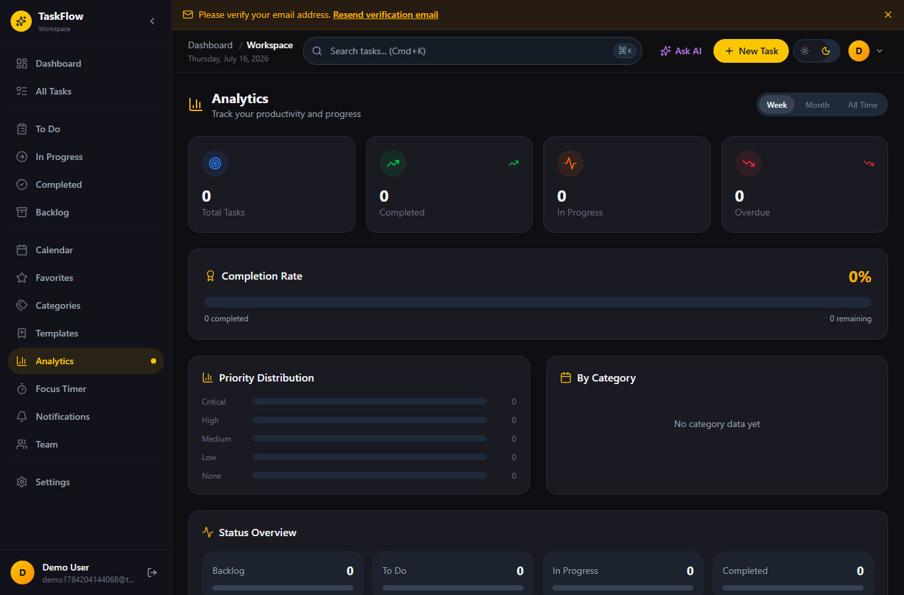
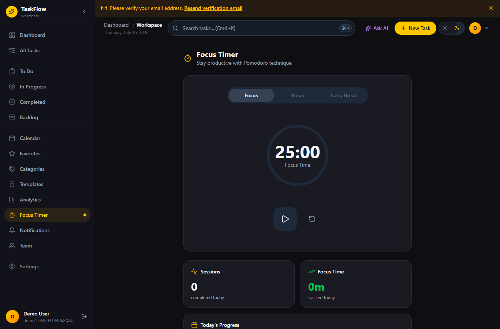
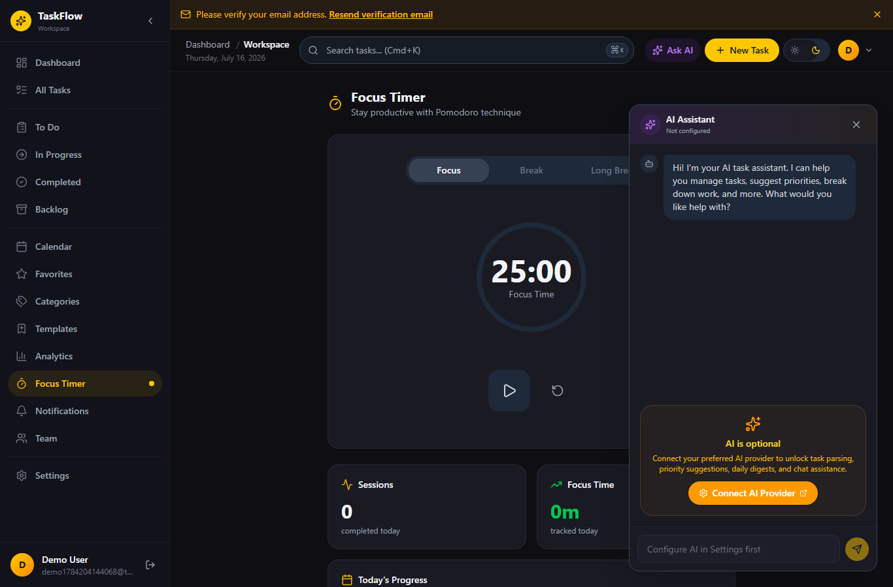
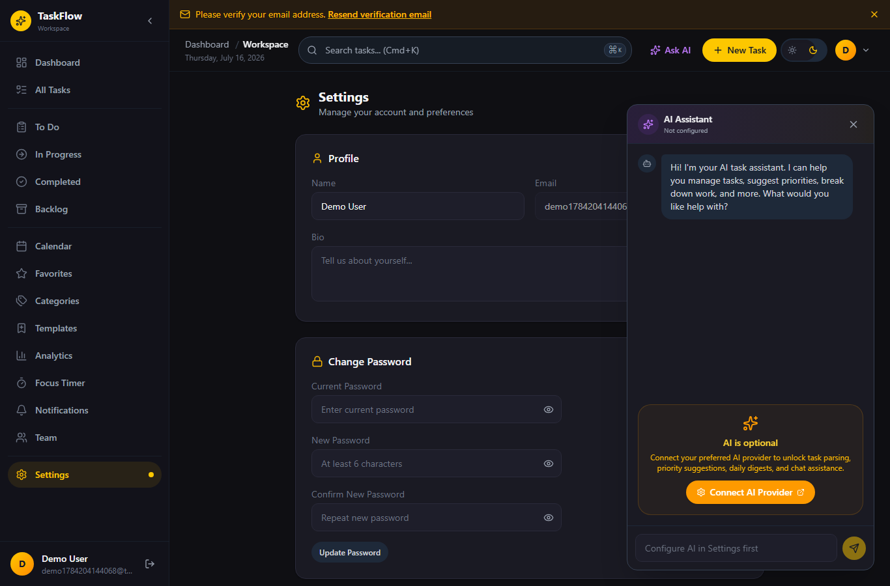

# TaskFlow

An AI-assisted task management platform built around a Kanban workflow, with focus
timers, time tracking, analytics, recurring tasks, calendar sync, and team
collaboration. The app is a single deployable unit: an Express + Socket.IO API that
also serves the built React SPA.

---

## Table of Contents

- [Overview](#overview)
- [Screenshots](#screenshots)
- [Features](#features)
- [Architecture](#architecture)
- [Tech Stack](#tech-stack)
- [Project Structure](#project-structure)
- [Getting Started](#getting-started)
- [Configuration](#configuration)
- [API](#api)
- [AI Providers](#ai-providers)
- [Scripts](#scripts)
- [Testing](#testing)
- [Deployment](#deployment)
- [License](#license)

---

## Overview

TaskFlow helps individuals and teams organize work through a flexible Kanban board
and a rich task model. Beyond basic CRUD, it offers:

- **AI assistance** for parsing natural language into tasks, breaking tasks down,
  suggesting priorities, generating daily digests, and chatting about your workload.
- **Focus & time tracking** via a Pomodoro-style timer and per-task time sessions.
- **Recurring tasks** that regenerate on a schedule (hourly job in the server).
- **Calendar integration** with iCal export and one-click Google / Outlook / Apple links.
- **Real-time collaboration** powered by Socket.IO (task moves, updates, presence).
- **Notifications** (in-app + optional email) for assignments, deadlines, mentions, and digests.

The AI, email, and external calendar features are all **optional** — the app degrades
gracefully (heuristic fallbacks) when no API keys are configured.

---

## Screenshots

| Screen | Preview |
|--------|---------|
| Login |  |
| Signup |  |
| Dashboard |  |
| Kanban |  |
| Calendar |  |
| Analytics |  |
| Focus Timer |  |
| AI Assistant |  |
| Settings |  |

---

## Features

### Task Management
- Kanban board with drag-and-drop across statuses (`backlog`, `pending`, `in-progress`, `review`, `completed`, `blocked`, `cancelled`).
- Rich tasks: subtasks, comments, tags, attachments, categories, priority, due dates, dependencies, favorites, and ordering.
- Batch operations and bulk actions.
- CSV / iCal export.

### AI Assistant
- Natural-language task parsing (`/api/ai/parse`).
- Automatic subtask breakdown from a task title/description.
- Priority suggestions across a task list.
- Daily digest generation and "next best action" recommendations.
- Conversational assistant aware of your task context.
- Provider-agnostic — plug in OpenAI, Gemini, Claude, Groq, OpenRouter, Together AI, or any OpenAI-compatible endpoint.

### Focus & Time Tracking
- Configurable Pomodoro timer (work / break / long-break durations, sessions before long break).
- Per-task time sessions with pause tracking, notes, and tags.
- Daily focus-time accumulation and streaks per user.

### Recurring Tasks
- Intervals: `daily`, `weekly`, `monthly`, `yearly`, `weekdays`.
- Optional end date; next occurrence computed automatically by a background job.

### Calendar
- Export filtered tasks to `.ics`.
- One-click subscription/add links for Google Calendar, Outlook, and Apple Calendar.

### Notifications
- In-app notifications for assignments, status changes, due-soon / overdue, mentions, and daily digests.
- Optional email delivery (deadline alerts, status changes, daily digest) via SMTP / Resend.

### Collaboration & Real-Time
- Socket.IO rooms per user; authenticated connections only.
- Live task move/update propagation and collaboration cursors.
- Team page, shared templates, notes, and an activity timeline.

### Accounts & Security
- Email/password auth with bcrypt hashing, refresh tokens, account lockout, and email verification.
- Google Sign-In (OAuth).
- Helmet security headers, CORS allow-list, rate limiting (in-memory or Redis-backed), request-ID tracing, and a global error handler.

### Customization
- Light / dark / system themes.
- Per-user preferences (notifications, Pomodoro settings) and profile (name, username, bio, avatar).

---

## Architecture

```
┌─────────────────────────┐         ┌──────────────────────────────┐
│  React SPA (client/)    │  HTTP/  │  Express API (server/)        │
│  Vite + Tailwind + TS   │  WS     │  REST + Socket.IO             │
│  Served as static build │ ──────► │  Controllers → Services →     │
│  from the same server   │         │  Mongoose Models              │
└─────────────────────────┘         └───────────────┬──────────────┘
                                                     │
                                                     ▼
                                            ┌──────────────────┐
                                            │  MongoDB (Mongoose)│
                                            └──────────────────┘
                                                     │
                          Optional integrations ─────┼───────
                          • AI providers (OpenAI,    │
                            Gemini, Claude, …)        │
                          • Email (SMTP/Resend)       │
                          • Google OAuth              │
```

**Request flow:** `server.js` wires global middleware (Helmet → request ID →
compression → logging → CORS → body parsing), initializes Socket.IO, mounts the
static SPA build and the `/api/*` routers, serves Swagger docs, and falls back to
`index.html` for any non-API route. Every API route except health/docs is protected
by the `protect` auth middleware and a rate limiter.

**Background jobs** run inside the server process:
- Recurring-task generation (hourly).
- Daily reset of per-user `focusTimeToday` (hourly).

**Real-time:** the client opens a single authenticated Socket.IO connection; the
server joins each socket to a `user:<id>` room and relays sanitized `task:move`,
`task:update`, and `collaboration:cursor` events.

---

## Tech Stack

| Layer        | Technology |
|--------------|------------|
| Frontend     | React 18, TypeScript, Vite 6, Tailwind CSS 4, Framer Motion, Lucide React, Axios, Sonner |
| Backend      | Node.js, Express 4, Mongoose 8, Socket.IO 4 |
| Database     | MongoDB |
| Auth         | JWT (access + refresh), bcrypt, Helmet, CORS, express-rate-limit |
| AI           | OpenAI SDK (provider abstraction over OpenAI / Gemini / Anthropic / Groq / OpenRouter / Together) |
| Email        | Nodemailer (SMTP / Resend, Ethereal in dev) |
| Calendar     | ical-generator |
| Docs         | Swagger (swagger-jsdoc + swagger-ui-express) |
| Infra        | Docker + Docker Compose |

---

## Project Structure

```
task-tracker/
├── client/                     # React + TypeScript SPA
│   ├── src/
│   │   ├── api/                # API client functions (axios)
│   │   ├── components/         # pages/, ui/, layout/, widgets/, domain components
│   │   ├── context/            # Auth & Theme providers
│   │   ├── hooks/              # Custom hooks (focus timer, Google auth)
│   │   ├── lib/                # Utilities
│   │   ├── App.tsx             # Router & app shell
│   │   └── main.tsx            # Entry point
│   ├── public/                 # Static assets, service worker
│   └── vite.config.ts
├── server/                     # Express API
│   ├── config/                 # db, cors, swagger, upload
│   ├── controllers/            # auth, task, ai, template, calendar, timeTracking, notification, system
│   ├── middleware/             # auth, errorHandler, rateLimiter, requestId
│   ├── models/                 # User, Task, TimeSession, TaskTemplate, Notification, ActivityLog
│   ├── routes/                 # Express routers per domain
│   ├── services/               # aiService, aiProviders/, emailService, icalService, socketService, passwordService
│   ├── validators/             # express-validator schemas
│   ├── utils/                  # logger, response, shutdown
│   └── server.js               # App entry point
├── docker-compose.yml          # mongo + server + client services
├── package.json                # Root scripts (dev, build, start)
└── README.md
```

---

## Getting Started

### Prerequisites
- Node.js 20+
- A MongoDB instance (local `mongod` or a MongoDB Atlas connection string)

### Local Development

```bash
# 1. Install dependencies for all three workspaces
npm install
cd server && npm install && cd ..
cd client && npm install && cd ..

# 2. Configure the server
cp server/.env.example server/.env
# Set at least MONGO_URI, JWT_SECRET, JWT_REFRESH_SECRET, CLIENT_URL

# 3. Run client + server together
npm run dev
```

- Web app: `http://localhost:3000`
- API: `http://localhost:5000`
- API docs: `http://localhost:5000/api/docs`

> The server serves the built client from `client/dist`. For development you
> typically run the Vite dev server on :3000 and the API on :5000; for production
> you build the client and let the API serve it.

### Using Docker

```bash
docker-compose up -d
```

This starts MongoDB, the API (`:5000`), and the built client (`:3000` → `:80`).

---

## Configuration

All server configuration is via environment variables. Copy `server/.env.example`
to `server/.env` and edit as needed.

| Variable             | Required | Default                  | Description |
|----------------------|----------|--------------------------|-------------|
| `MONGO_URI`          | Yes      | —                        | MongoDB connection string |
| `JWT_SECRET`         | Prod     | —                        | Access-token signing secret |
| `JWT_REFRESH_SECRET` | Prod     | —                        | Refresh-token signing secret |
| `CLIENT_URL`         | Prod     | `http://localhost:3000`  | Allowed CORS origin / app URL |
| `PORT`               | No       | `5000`                   | API port (1–65535) |
| `NODE_ENV`           | No       | `development`            | `development` or `production` |
| `GOOGLE_CLIENT_ID`   | No       | —                        | Enables Google Sign-In |
| `RESEND_API_KEY`     | No       | —                        | Enables transactional email |
| `REDIS_URL`          | No       | —                        | Enables Redis-backed rate limiting |
| `VITE_GOOGLE_CLIENT_ID` | No   | —                        | Client-side Google button (`client/.env`) |

Secrets are validated on startup — the server refuses to boot if `MONGO_URI` is
missing, and in production if `JWT_SECRET`, `JWT_REFRESH_SECRET`, or `CLIENT_URL`
are missing.

---

## API

Interactive docs: `GET /api/docs` (Swagger UI) and `GET /api/docs.json` (OpenAPI spec).
All routes below require a `Bearer` access token unless marked otherwise.

### Tasks
| Method | Endpoint                        | Purpose |
|--------|---------------------------------|---------|
| GET    | `/api/tasks`                    | List/filter tasks |
| POST   | `/api/tasks`                    | Create task |
| GET    | `/api/tasks/:id`                | Get one task |
| PUT    | `/api/tasks/:id`                | Update task |
| DELETE | `/api/tasks/:id`                | Delete task |
| GET    | `/api/tasks/stats`              | Task statistics |
| GET    | `/api/tasks/activity`           | Activity log |
| GET    | `/api/tasks/export`             | CSV export |
| POST   | `/api/tasks/batch`              | Bulk update |
| PUT    | `/api/tasks/order`              | Reorder tasks |
| POST   | `/api/tasks/:id/subtasks`       | Add subtask |
| PUT    | `/api/tasks/:id/subtasks/:sid`  | Update subtask |
| DELETE | `/api/tasks/:id/subtasks/:sid`  | Delete subtask |
| POST   | `/api/tasks/:id/comments`       | Add comment |
| DELETE | `/api/tasks/:id/comments/:cid`  | Delete comment |
| POST   | `/api/tasks/:id/timer/start`    | Start time session |
| POST   | `/api/tasks/:id/timer/stop`     | Stop time session |
| POST   | `/api/tasks/:id/favorite`       | Toggle favorite |

### AI
| Method | Endpoint                       | Purpose |
|--------|--------------------------------|---------|
| POST   | `/api/ai/parse`                | Parse natural language → task |
| POST   | `/api/ai/breakdown/:id`        | Generate subtasks |
| POST   | `/api/ai/suggest-priorities`   | Suggest priorities |
| GET    | `/api/ai/digest`               | Daily digest |
| POST   | `/api/ai/chat`                 | Chat with assistant |
| POST   | `/api/ai/generate-title`       | Generate title from description |
| GET    | `/api/ai/suggest-next-action`  | Recommend next task |

### Other
| Method | Endpoint                         | Purpose |
|--------|----------------------------------|---------|
| GET/POST/PUT | `/api/templates`           | Task templates |
| GET    | `/api/calendar/ical`             | iCal export |
| GET    | `/api/calendar/links`            | Google/Outlook/Apple links |
| GET/POST | `/api/time-tracking/sessions`    | Time sessions |
| GET    | `/api/notifications`             | List notifications |
| GET    | `/api/health`                    | Health check |
| GET    | `/api/system/*`                  | Dev diagnostics |

---

## AI Providers

AI keys are entered **per user** in *Settings → AI* and stored securely on the
`User` document (the key is excluded from API responses). If no provider is
configured, the AI service returns safe heuristic fallbacks so the app keeps
working.

| Provider           | Default Model | Notes |
|--------------------|---------------|-------|
| OpenAI             | `gpt-4o-mini` | General purpose |
| Google Gemini      | `gemini-1.5-flash` | Free tier available |
| Anthropic Claude   | `claude-3-5-sonnet` | Reasoning-focused |
| Groq               | `llama-3.3-70b` | Low-latency, free tier |
| OpenRouter         | `openai/gpt-4o-mini` | 200+ models via one key |
| Together AI        | `Llama-3.3-70B` | Open-source models |
| OpenAI Compatible  | (custom) | Any self-hosted / custom endpoint |

---

## Scripts

| Command            | Location | Purpose |
|--------------------|----------|---------|
| `npm run dev`      | root     | Run client + server concurrently |
| `npm run build`    | root     | Build the client for production |
| `npm start`        | root     | Start the production server (serves built client) |
| `npm run dev`      | `server` | Run API with nodemon |
| `npm start`        | `server` | Run API with node |
| `npm test`         | `server` | Run Jest tests |
| `npm run dev`      | `client` | Run Vite dev server |
| `npm run build`    | `client` | Build client bundle |
| `npm test`         | `client` | Run Vitest unit tests |
| `npm run test:e2e` | `client` | Run Playwright E2E tests |

---

## Testing

- **Server:** `cd server && npm test` (Jest + Supertest, uses an in-memory MongoDB).
- **Client:** `cd client && npm test` (Vitest) and `npm run test:e2e` (Playwright).

Run server tests before opening a pull request.

---

## Deployment

**Single-process (recommended):** build the client, then start the server — it
serves both the API and the SPA from one port.

```bash
npm run build      # builds client/dist
npm start          # NODE_ENV=production, serves API + SPA on PORT
```

Set `NODE_ENV=production`, configure `MONGO_URI`, `JWT_SECRET`,
`JWT_REFRESH_SECRET`, and `CLIENT_URL`. For rate limiting at scale, set `REDIS_URL`.

**Docker:** `docker-compose up -d` provisions MongoDB, the API, and the client.

---

## License

MIT
